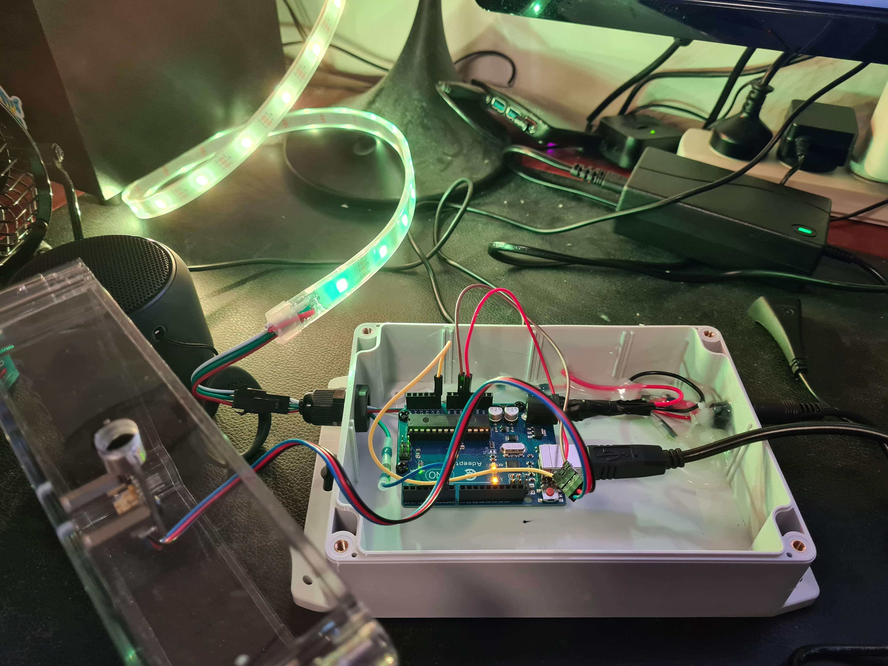

# Sound-Sensitive-Leds
> This is my version of sound sentive LEDs made using the WS2812B LED strip.

*In order to upload this code into Arduino-Uno you will need to setup components as follows:*

### Component List:

1. WS2812B LED Strip [CORE-ELECTRONICS](https://core-electronics.com.au/5m-rgb-led-strip-ws2812-30-per-meter-white-strip-weatherproof.html)
2. Arduino Uno [CORE-ELECTRONICS](https://core-electronics.com.au/arduino-uno-r3.html)
3. Female to Male Jumper Wires [CORE-ELECTRONICS](https://core-electronics.com.au/premium-female-male-extension-jumper-wires-20-x-3.html)
4. Analog Sound Sensor [CORE-ELECTRONICS](https://core-electronics.com.au/analog-sound-sensor.html)
5. Project Box of your Choice [CORE-ELECTRONICS](https://core-electronics.com.au/plastic-project-box-enclosure-waterproof-clear-cover-6-61x4-72x-2-17-inch.html)
6. 5v 8A Power Supply [eBay](https://www.ebay.com.au/itm/114604088431?var=414779075060)
7. Barell Jack Adapter [CORE-ELECTRONICS](https://core-electronics.com.au/dc-barrel-jack-adapter-breadboard-compatible.html)

### The Components should be setup as shown in the diagram below:

*If you've done the setup as above your project box should look something like below (minus the excess hot glue :) )

